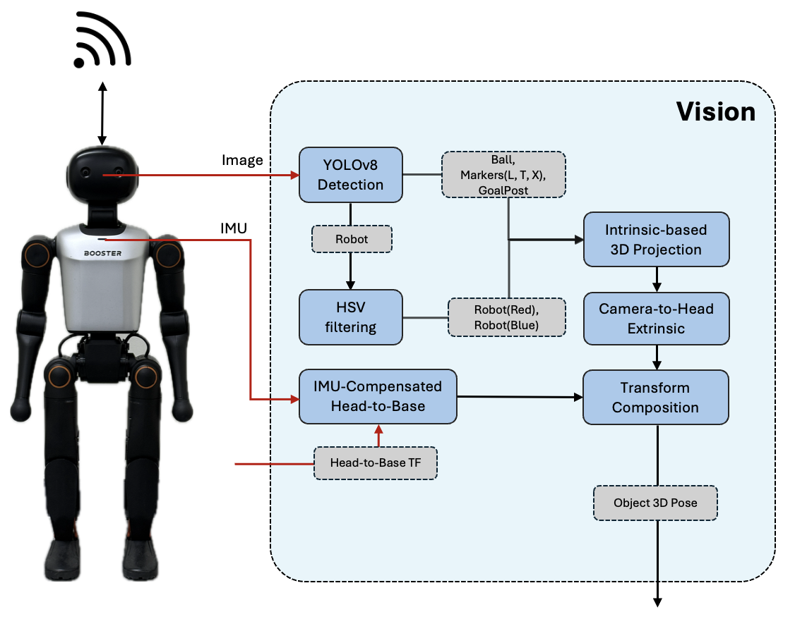

# INHA-Vision

Hi 👋 We are Inha-United !
Inha-United is a team competing in the RoboCup Soccer Humanoid League.

This repository focuses on vision algorithms and methodologies for perception in autonomous humanoid soccer robots, and includes object detection as well as processing pipelines that convert detected objects into the robot coordinate frame.

Starting from the demo provided by Booster Robotics, we have modularized the system, extended its functionality, and continuously improved its performance through our own research and development efforts.

# :soccer: INHA Vision
**Advanced Autonomous Agent for Humanoid Soccer**

*Real-time Detection • 3D position estimation • Robust Perception under Motion*

---

## Mission & Vision
**"To enable humanoid robots to perceive the game reliably, even while moving."**

**INHA Vision** aims to provide a robust and extensible perception pipeline for humanoid soccer robots operating in highly dynamic environments.  
Our goal is not only to detect objects, but to **reliably infer their 3D positions in the robot coordinate frame under walking, vibration, and partial occlusion**.

Starting from the baseline vision demo provided by **Booster Robotics**, we redesigned the system into a modular, research-oriented perception stack and continuously improved its robustness through real-world experiments and competition-driven development.

---

## Key Capabilities

### **Real-Time Object Detection**
We employ a YOLOv8-based detector optimized for embedded platforms.
* Detection of **ball, goalposts, robots, and field markers (L/T/X, penalty point)**
* TensorRT-optimized inference for **Jetson Orin NX**
* Stable frame rate under on-board real-time constraints

### **3D Localization in Robot Frame**
Detected objects are converted from image space into metric 3D positions:
* Intrinsic-based pixel-to-ray projection
* Class-dependent reference points (center / bottom-center of bounding box)
* Transformation into the **base frame** using kinematic and sensor data

### **IMU-Compensated Perception**
To handle posture changes during walking:
* Roll/Pitch angles from the onboard IMU are integrated into the camera-to-base transform
* Reduces ground-plane projection error during dynamic motion
* Improves stability of ball and landmark localization while walking

---

## System Architecture

The system is built on a robust perception-action loop:

  

---

    <b>Built with by INHA United</b> 
    <i>Pushing the boundaries of Autonomous Soccer</i>

