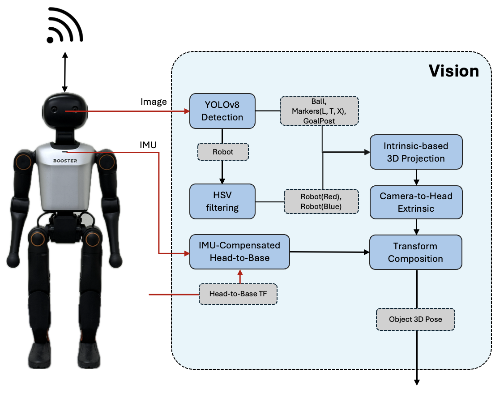

# ⚽️ INHA Vision
**Advanced Autonomous Agent for Humanoid Soccer**

*robust Detection • real-time inference • 3D position estimation*
**"To enable humanoid robots to perceive the game reliably, even while moving."**

The **INHA Vision** is designed as a visual perception module to enable stable recognition even during movement. It reliably detects and tracks balls, robots, goalposts, and field markers(L, T, X) in dynamic environments with varying lighting conditions.

---

## Key Features

### **Robust Object Detection**
We employ a YOLOv8-based detector optimized for embedded platforms.
* Detection of ball, goalposts, robots, and field markers (L, T, X)
* Trained on over 40,000 annotated images, including public datasets and in-house data
* Detection Performance

| Method      | Precision | Recall | mAP@50 | mAP@50–95 |
|-------------|-----------|--------|--------|-----------|
| Baseline    | 0.953     | 0.916  | 0.964  | 0.687     |
| Ours        | 0.943     | 0.940  | 0.970  | 0.702     |

### **Real-Time Inference**
To meet strict real-time constraints on embedded humanoid platforms, the vision model is optimized using NVIDIA TensorRT.
* Conversion of trained detection models to TensorRT engines for low-latency inference
* Stable real-time performance on Jetson Orin NX under on-board computational constraints
* The average inference time is 33 ms

### **3D Pose Estimation in Robot Frame**
Detected objects are converted from image space into metric 3D positions:
* Intrinsic-based pixel-to-ray projection
* Transformation into the base frame using IMU-compensated kinematic data
* mean position error was reduced by 31.9 % compared to the K1 baseline

---

## System Architecture

The detailed system architecture is illustrated in the figure below.

  

---

    <b>Built by INHA United</b> 
    <i>Pushing the boundaries of Autonomous Soccer</i>

